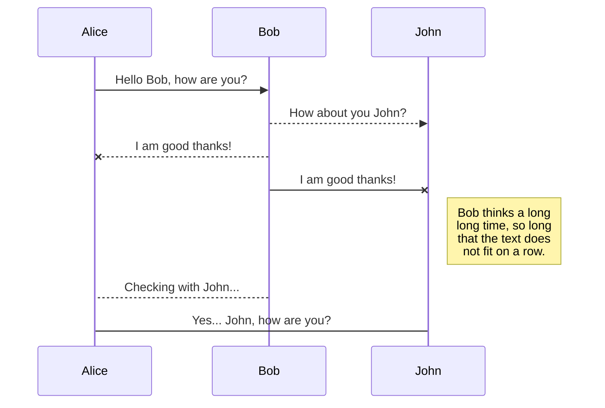

# Lightning Talk Topics

## Day 2

**Javascript** 

  - Strings are objects
  - Basic String manipulation
    - trim
    - padStart / padEnd
    - toUpper/Lower
    - toString
    - valueOf
    
    
**CSS**
  - 

## Day 3
**Javascript**
  - String Bits
    - charAt (new str)
    - subStr (new str)
    - replace (new str)
    - includes (bool)
    - indexOf (#)
    - endsWith (bool)
    - startsWith (bool)
    
**CSS**
  - foo
  

## Day 4
**Javascript**
  - Strings Bits ... as Arrays
    - string.length (#)
    - string[#]  (new str)
    - string.slice (new str)
    
**CSS**
  - foo
  
## Day 5
**Javascript**
  - foo
    
**CSS**
  - foo
  
## Day 6
**Javascript**
  - Arrays
    
**CSS**
  - foo
  
  
## Day 7
**Javascript**
  - foo
    
**CSS**
  - foo
  
  
## Day 8
**Javascript**
  - foo
    
**CSS**
  - foo
  
  
## Day 9
**Javascript**
  - foo
    
**CSS**
  - foo
  
  
## Day 10 (already doing functional...)
**Javascript**
  - foo
    
**CSS**
  - foo
  
  
## Day 11  (NONE)
**Javascript**
  - Objects
    
**CSS**
  - foo
  
  
## Day 12
**Javascript**
  - foo
    
**CSS**
  - foo
  
  
## Day 13
**Javascript**
  - foo
    
**CSS**
  - foo
  
## Day 14
**Javascript**
  - foo
    
**CSS**
  - foo
  
  
## Day 15 (NONE - Brook)
**Javascript**
  - foo
    
**CSS**
  - foo
  
  
